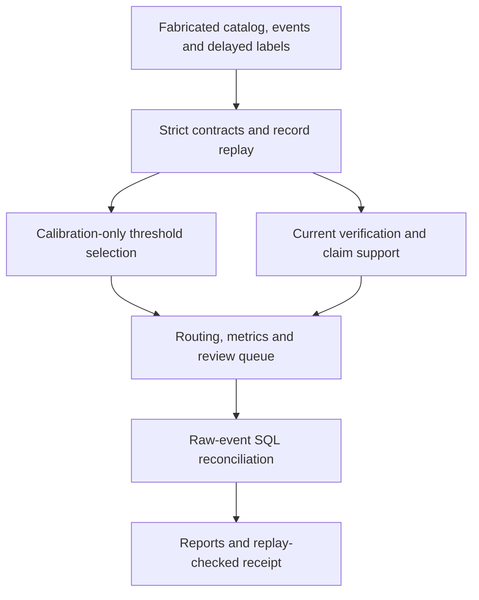

# Citizen Evidence and the Revisable Administrative Record — Research Engineering Demonstration

Public engineering companion for **_Citizen Evidence and the Revisable Administrative Record: Unequal Visibility, Verification and the Limits of Correction_**.

This repository builds **review routing and revisable evidence records** with fabricated inputs. It demonstrates how to select a decision threshold, require current verification, and keep a recorded correction from becoming an unsupported claim of successful remedy. It contains no private manuscript, exact private formal design, empirical data or authoritative scientific results.

## Implemented capabilities

| Capability | Executable evidence |
|---|---|
| Decision thresholds | Separate calibration and holdout sets; delayed labels; cost, recall and capacity constraints |
| Signal integrity | Declared integer weights; exact schemas; missing-signal abstention |
| Verification workflow | Actor-role checks; separate submitter/verifier IDs; version and hash witnesses; expiry |
| Revisable record | Sequential evidence revisions, withdrawal, verification replacement and correction history |
| Claim boundaries | Positive target allowlist; unknown targets blocked; support re-evaluated at observation time |
| Independent validation | DuckDB reconstructs accepted transitions, state, claims, scores and metrics from raw events |
| Investigation queue | One stable review item per record with explicit reasons and no wrongdoing assertion |
| Reproducibility | Source/artifact hashes, semantic replay and independent warehouse rebuild |
| Original companion | Four toy arithmetic scenarios, explicit lineage and six executed rejection benchmarks |
| Automation | Unit, integration and mutation tests; GitHub Actions; Docker |

## Quick start

```bash
python3 -m pip install -r requirements.txt
./run_all_demos.sh
```

The combined runner executes the original companion and the new record workflow. Expected final marker: `ALL_PUBLIC_DEMOS_STATUS=PASS`.

```bash
# New workflow and its tests only
./run_records_demo.sh

# Verify saved inputs, derived tables, reports and database
python3 -m record_engineering.pipeline --verify-only

# Observe later arriving labels and verification events
python3 -m record_engineering.pipeline \
  --as-of 2026-02-06T00:00:00Z --output outputs/records-later

# Container repeats both demos and both test suites
docker build -t citizen-evidence-revisable-record-engineering .
docker run --rm citizen-evidence-revisable-record-engineering
```

Open `outputs/records/dashboard.html` locally. The directory also contains threshold candidates, cohort metrics, record/audit/claim tables, a review queue, a DuckDB database, a report and an unsigned run receipt. Generated outputs are Git-ignored; CI uploads the public outputs as a workflow artifact.

## Architecture



## Default synthetic result

The fixture has **160 records**: 80 calibration, 64 holdout and 16 operational scenarios. At the fabricated observation time `2026-02-01T00:00:00Z`, the selected review threshold is **0.55** and declared priority threshold **0.80**. The score is a weighted index, not a probability.

The holdout includes 60 scorable records: **48 with mature labels and 12 with pending labels**. Four other records lack required signals. On the 48 labeled, scorable fixtures: TP 21, FP 1, TN 24, FN 2. These deliberately constructed outcomes demonstrate validation mechanics; they do not estimate real-world performance.

There are **43 review records** and **18 claim requests**: 4 active, 9 blocked, 1 expired, 3 retracted and 1 superseded. Unknown claims are denied even if evidence and verification witnesses exist.

## Documentation

- [Threshold design and denominators](docs/decision_thresholds.md)
- [Revision, verification and claim semantics](docs/revisable_records.md)
- [Data quality and independent SQL controls](docs/data_quality.md)
- [Reproducibility and receipt limits](docs/reproducibility.md)
- [Executed validation record](docs/record_validation.md)
- [CV evidence and supported wording](docs/cv_evidence.md)
- [Scientific boundary](docs/scientific_boundary.md)

A passing check establishes consistency with this public toy specification. It does not establish evidence truth, authenticated identity, lawful authority, successful remedy, causal effects, empirical findings, population fairness or deployment effectiveness.

## Author

**Mahfuzur Rahman**

Copyright © Mahfuzur Rahman. All rights reserved.
